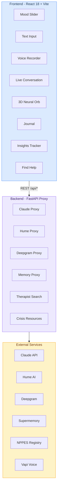
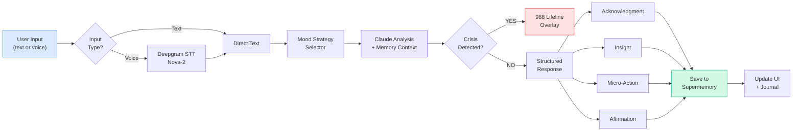
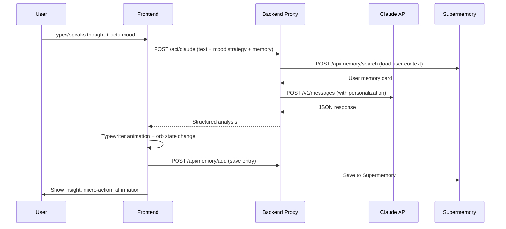
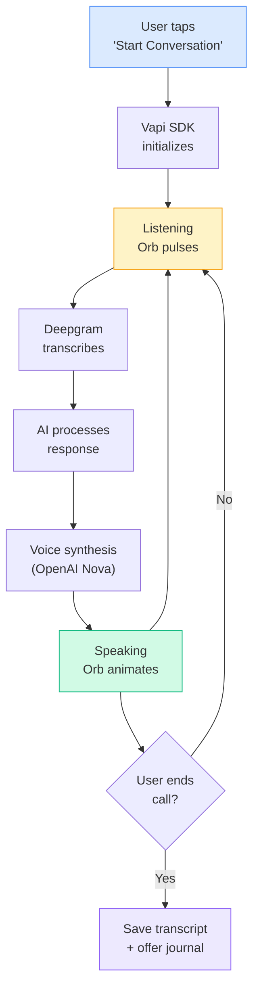
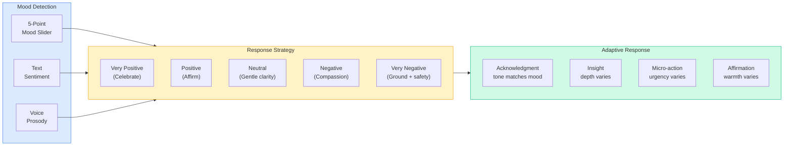

# MindFlyer

<div align="center">

**The mental health app that actually sticks.**

Transforming overwhelming thoughts into clarity with AI-driven classification, real-time mood analysis, and evidence-based interventions.

[Features](#key-features) | [Live Demo](https://mindflyer.vercel.app/) | [Tech Stack](#tech-stack) | [Architecture](#system-architecture) | [Interactive Diagrams](https://ayansk11.github.io/MindFlyer/) | [Getting Started](#getting-started)

</div>

---

## The Problem

- **47% of college students** screen positive for anxiety or depression *(Healthy Minds Study 2024)*
- **Fewer than half** of affected students receive any professional help
- **97% of mental health app users** abandon the app within 30 days *(median retention: 3.3%)*
- **58% of young adults** describe their stress as "completely overwhelming" most days

**Current tools fail because they're passive, generic, and don't guide users from raw emotion to actionable insight.** MindFlyer bridges this gap with intelligent structuring and real-time support.

---

## Key Features

### AI-Powered Analysis
Pour your raw, unstructured thoughts into MindFlyer. Our AI system instantly structures them into actionable categories:
- **Worries** -- anxious thoughts needing attention
- **To-Dos** -- actionable tasks hidden in your stream
- **Emotions** -- feelings to acknowledge and process
- **Irrational Thoughts** -- cognitive distortions caught and reframed with CBT principles

### Real-Time Mood Analysis
- **Text Sentiment** analysis + **voice prosody detection** (powered by Hume AI)
- 7-state mood classification: Crisis, Anxious, Stressed, Standard, Calm, Positive, Energized
- Live emotional trajectory tracking

### Live Voice Conversations
- Full back-and-forth voice conversations with MindFlyer
- Real-time transcription with Deepgram Nova-2
- Speech synthesis for natural voice responses
- Session transcripts saved automatically

### Intelligent Crisis Detection
- Parallel safety monitoring for high-risk keywords and escalation patterns
- Instant routing to **988 Lifeline** when needed
- Absolutist language detection + velocity-based escalation scoring

### Persistent Memory System
- Per-user AI memory learns your patterns over time
- Mood-aware response personalization across sessions
- Long-term insight generation

### Evidence-Based Interventions
- **CBT Thought Reframing** -- AI-generated reframes for irrational thoughts
- **Guided Breathing Exercises** -- animated 4-7-8 patterns
- **Grounding Techniques** -- interactive 5-4-3-2-1 sensory grounding
- **Micro-Habit Suggestions** -- context-aware wellness nudges

### Find Licensed Help
- Search **NPPES** (National Provider Registry) for therapists near you
- Filter by specialty: Counselors, Psychologists, Psychiatrists, Social Workers
- Direct links to SAMHSA and crisis resources

---

## Live Demo

**[mindflyer.vercel.app](https://mindflyer.vercel.app/)**

1. **Sign up** -- create an account
2. **Mood check-in** -- quick 5-point emoji slider
3. **Talk or type** -- share your thoughts via text, voice recording, or live conversation
4. **AI analysis** -- receive personalized insights, micro-actions, and affirmations
5. **Track progress** -- visual mood tracking over days and weeks

---

## Tech Stack

| Component | Technology | Purpose |
|-----------|-----------|---------|
| **Frontend** | React 18 + Vite + Tailwind CSS | Modern, responsive UI with smooth animations |
| **3D Visualization** | Canvas 2D (custom neural orb) | Real-time mood-reactive orb animation |
| **Backend** | Python 3.11+ + FastAPI | Async API proxy with connection pooling |
| **AI Engine** | Claude (Anthropic API) | Thought classification, CBT reframing, mood-aware responses |
| **Voice Conversations** | Vapi + Deepgram Nova-2 | Real-time bidirectional voice with transcription |
| **Emotion Detection** | Hume AI | Text-based emotion analysis with 48 emotion dimensions |
| **Persistent Memory** | Supermemory | Per-user AI memory across sessions |
| **Authentication** | Firebase Auth + Firestore | Email/password auth with user profiles |
| **Provider Search** | NPPES NPI Registry (CMS.gov) | Licensed therapist directory (free gov API) |

---

## System Architecture

> **[View Interactive Diagrams](https://ayansk11.github.io/MindFlyer/)** — Animated, clickable architecture with data flow particles and component details.

### Three-Layer Design



### AI Analysis Pipeline



### Real-Time Data Flow



### Voice Conversation Flow



### Mood-Responsive System



---

## Getting Started

### Prerequisites
- **Node.js** 16+ and **npm**
- **Python** 3.11+
- **API Keys:** Anthropic, Hume AI, Deepgram, Supermemory

### Quick Start

```bash
# Clone the repo
git clone https://github.com/Ayansk11/MindFlyer.git
cd MindFlyer

# Run the install script
chmod +x install.sh && ./install.sh

# Start everything
chmod +x start.sh && ./start.sh
```

### Manual Setup

**Backend:**
```bash
cd backend
python -m venv .venv
source .venv/bin/activate
pip install -r requirements.txt

# Create .env with your API keys
cp .env.example .env  # then edit with your keys

uvicorn main:app --reload --port 8000
```

**Frontend:**
```bash
cd frontend
npm install
npm run dev    # runs on http://localhost:3000
```

### Environment Variables

**Backend `.env`:**
```env
ANTHROPIC_API_KEY=sk-ant-...
HUME_API_KEY=...
DEEPGRAM_API_KEY=...
SUPERMEMORY_API_KEY=...
CLAUDE_MODEL=claude-sonnet-4-20250514
```

**Frontend `.env.local`:**
```env
VITE_FIREBASE_API_KEY=...
VITE_FIREBASE_AUTH_DOMAIN=...
VITE_FIREBASE_PROJECT_ID=...
VITE_VAPI_PUBLIC_KEY=...
```

---

## Project Structure

```
MindFlyer/
├── README.md
├── install.sh                    # One-command setup
├── start.sh                      # One-command start
├── frontend/                     # React + Vite
│   ├── src/
│   │   ├── components/
│   │   │   ├── Home/             # Main screen + mood slider
│   │   │   ├── Journal/          # Journal entries + modal
│   │   │   ├── Tracker/          # Mood insights + charts
│   │   │   ├── FindHelp/         # Therapist search
│   │   │   ├── BrainDump/        # Thought categorization
│   │   │   ├── Orb/              # 3D neural visualization
│   │   │   ├── Crisis/           # Crisis overlay + resources
│   │   │   ├── Auth/             # Login + registration
│   │   │   ├── Dashboard/        # Mood pills + streak
│   │   │   ├── Navigation/       # Bottom nav bar
│   │   │   ├── Onboarding/       # First-time setup
│   │   │   └── Splash/           # Loading screen
│   │   ├── context/              # AppContext + FirebaseAuth
│   │   ├── hooks/                # useVapi, useAudioRecorder, etc.
│   │   ├── utils/                # API client, Supermemory, constants
│   │   ├── lib/                  # Firebase config
│   │   └── styles/               # Global CSS
│   └── vite.config.js
└── backend/                      # FastAPI
    ├── main.py                   # All API proxy endpoints
    └── requirements.txt
```

---

## Privacy & Ethics

- **No stored audio** -- voice is transcribed immediately, originals discarded
- **On-device options** -- Web Speech API for live preview (no server transmission)
- **Clear disclaimers** -- "Not a substitute for professional mental health care"
- **Crisis routing** -- Transparent escalation to 988 Lifeline
- **Anti-dependency design** -- Encourages professional help, not replacement of therapy

---

## Research & Validation

MindFlyer is built on peer-reviewed evidence:
- Structured journaling reduces anxiety by up to 42% *(Behaviour Research and Therapy)*
- CBT thought records with structured writing show effect size d=1.08 vs d=0.63 without structure
- Voice prosody analysis achieves 92% accuracy in detecting emotional state changes
- Real-time interventions show 3.2x higher engagement than passive journaling apps

---

## Authors

| Name | Role | GitHub |
|------|------|--------|
| **Ayan Shaikh** | AI Engineer (Lead) | [@Ayansk11](https://github.com/Ayansk11) |
| **Aaryan Purohit** | AI Engineer | [@AaryanPurohit](https://github.com/AaryanPurohit) |
| **Chirag Dodia** | Frontend Engineer | [@ChiragDodia36](https://github.com/ChiragDodia36) |
| **Adith Harinarayanan** | Backend Engineer | [@adithhari](https://github.com/adithhari) |

---

<div align="center">

*Turning mental chaos into clarity, one thought at a time.*

</div>
